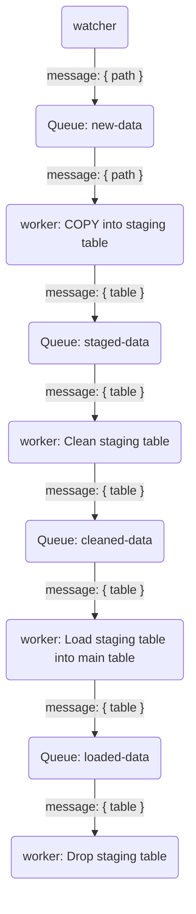

# Taxi Trips Chicago 2024 data pipeline

## Summary

This is a sample data pipeline for processing the [Taxi Trips Chicago 2024](https://www.kaggle.com/datasets/adelanseur/taxi-trips-chicago-2024?resource=download) dataset from Kaggle.

The pipeline uses [PostgreSQL](https://www.postgresql.org) as its database, [dbt](https://www.getdbt.com) for modelling and transformations, custom services for loading data, [Docker Compose](https://docs.docker.com/compose/) for building and orchestrating everything.

For a high-level overview, the pipeline:

- watches for CSV files in the `data-intake/` folder
- takes new files and loads them into a staging table in the database using `COPY`
- does some preliminary cleaning of the data and collects rejected trips into the `bad_trips` table
- moves the cleaned data from the staging table into the main date-partitioned `trips` table
- drops the staging table
- generates a `shifts` model that aggregates individual taxi trips into shifts if they are less than 60 minutes apart and calculates some metrics for them
- provides a report that shows the top 10 earning shifts each week

## Components

### `data-downloader`

A simple utility service for downloading the dataset from Kaggle and splitting it up into weekly batches.
The Python script that does this can be found at [data/prepare.py](data/prepare.py).

### `database`

PostgreSQL service, see [00_initdb.sql](database/00_initdb.sql) for more information on the schema and setup.
The database uses [pg_partman](https://github.com/pgpartman/pg_partman) for automated partition management.

### `watcher`

Watches the `data-intake` folder for CSV files and publishes any new ones to the `new-data` queue.
Because there is only one intake folder, this service runs as a single instance.
The actual loading and processing of the data starts from the `new-data` queue so this being a singleton service should not hold back the performance of the overall pipeline.

### `worker`

The `worker` service operates in a number of discrete steps, each working off a [pg-boss](https://github.com/timgit/pg-boss) queue.

The queues and their corresponding message payloads are defined in [queues.ts](pipeline/src/shared/queues.ts):

```ts
export default {
  newData: await queue<{ path: string }>("new-data"),
  stagedData: await queue<{ table: string }>("staged-data"),
  cleanedData: await queue<{ table: string }>("cleaned-data"),
  loadedData: await queue<{ table: string }>("loaded-data"),
};
```

A diagram of the data loading process:



You can read the code for each of these steps in [worker.ts](pipeline/src/worker.ts).

The overall goal was to make the individual steps small, simple, discrete and easy to debug and monitor.
Decoupling operations using queues gives us the option of scaling the worker pools individually per step as performance bottlenecks crop up.

CSV files are renamed after staging and any file ending with `.staged.csv` or `.failed.csv` in the `data-intake/` folder will be ignored.
Only new data (based on `trip_id`) is inserted into the `trips` table and duplicate entries are ignored.

Bad data that is cleaned up in the pipeline is collected into the `bad_trips` table.
Each trip entry contains the corresponding data file path to make debugging easier.

### `dbt`

`dbt` setup is located at [dbt/](dbt).
The `shifts` model is defined in [shifts.sql](dbt/models/shifts.sql) and uses an incremental materialization.

In an incremental update, new trips are loaded from the `trips` table by comparing `trips.created_at` timestamps to the latest `shifts.updated_at` timestamp.
They are then aggregated into shifts normally and the resulting new shifts will be checked for overlap with any existing ones in `shifts` and either merged or inserted as new.

### `report`

Queries and prints out a report of top 10 shifts per week for all of the weeks we have data for.
The script for generating this report can be found at [report.ts](pipeline/src/report.ts).

## Usage

To start the data pipeline, run:

```
docker compose up
```

Wait until all the services come up and weekly data files have appeared in the `data` directory.

### Processing data

To start ingesting data, move CSV file(s) into the `data-intake` folder.
The pipeline will automatically detect and process new files from there.

Once a file is successfully loaded into a staging table, it will be renamed with a `.staged.csv` extension.
If loading fails, the data file will be renamed with a `.failed.csv` extension.

To re-ingest a data file, just rename it and remove `.staged` or `.failed`.

### Viewing reports

To see a report of the highest-earning taxi shifts per week based on the latest data, run:

```
docker compose run report
```

### Updating `dbt` models

To update the `shifts` model, you can run:

```
docker compose run dbt run
```

The model is updated incrementally so the updates are faster if this command is run after each new batch is ingested.

This command will also execute before each report is generated so that the data returned always reflects the latest state of the database.

### Re-download data

To repopulate the weekly taxi trip CSV files in `data`, you can run:

```
docker compose run downloader
```

## Bottlenecks, known issues, further development

The file watcher service is currently designed to run only a single instance but since its only job is to watch a folder for new files and publish messages, it should be fairly performant.

The current queue setup is very simplistic and for a production deployment would need additional configuration to add deadlettering, monitoring and potentially retries.
Queues and data currently use the same Postgres instance for simplicity.
As a further development, these could be either split between multiple database instances or the `pg-boss` based simple queue system could be swapped out for a dedicated service.

Pipeline workers can be scaled up or down as needed for throughput.
Each worker services all queues in the pipeline but for larger data volumes it will probably be necessary to pool and scale them per queue.
The slowest step in the ingestion pipeline seems to be loading cleaned data from a staging table into the final partitioned `trips` table.
